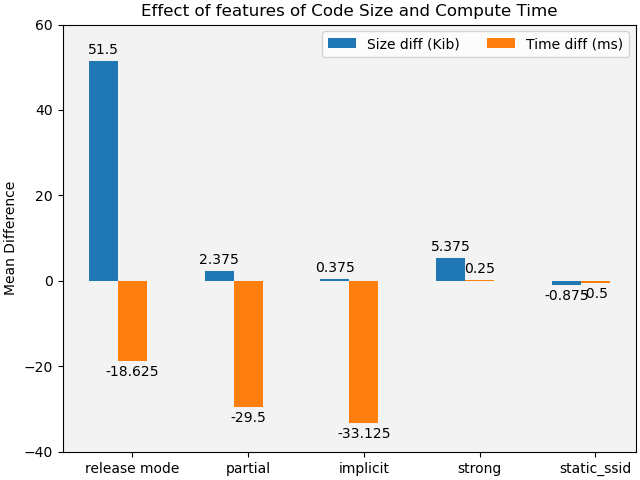
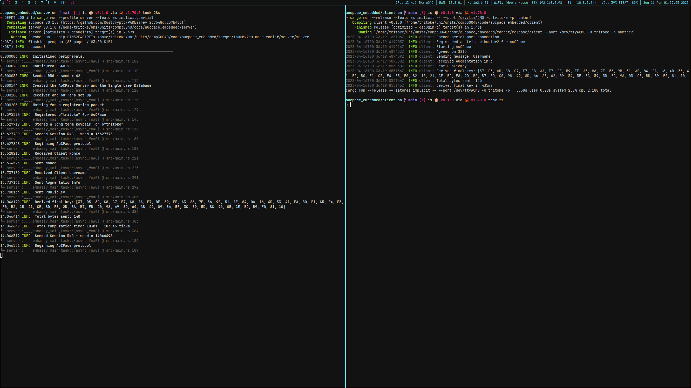

# aucpace_embedded
A repository to hold the code for an example embedded application utilising AuCPace and Rust.

## benchmarks

Effect of feature flags and compilation mode on Compute Time (ms) and Code Size (Kib).

## Example run

